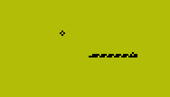

# Snake Game AI with Gradient Policy

In this small project I am attempting to train a model using gradient policy method as described by Andrej Karpathy on this [page](http://karpathy.github.io/2016/05/31/rl/). So far I have not succeeded.

The game I used is from http://helpfulsheep.com/snake/, which tries to mimic the snake game from Nokia. There are several points about the implementation:

- The game is without the border. So hitting the wall will make the snake comes out of the other side. Actually, I think it should be easier to start with the bordered game, but I cannot get the game at the website to do that.
- The agent get the information and plays the game through Selenium
- At each time step we take a screenshot of the game and crop the image to only include the game screen (excluding the border and the screen), like this:

- After cropping the image, we convert the image to a numpy array, consisted only of 1s and 0s.
- We take the (raveled) array as an input to our model, which we will feed to the hidden layer with a ReLU nonlinearity
- There are four output units, each correspond to an action (up, right, down, or left)
- The output is a probability distribution created using softmax function, and we randomly take the action based on that probability distribution (by using `np.random.choice`)

For the detail about gradient policy, please refer to this [page](http://karpathy.github.io/2016/05/31/rl/).

I know that the model need to be tweaked further because just after two games, when I updated the weights, the probability distribution has already converged (e.g. `[0, 0, 1, 0]`), which I think prevents other action from being chosen, which in turns prevent the parameters to be improved.

TODO:
- [ ] Alternative version where the action is from the snake's perspective, so the actions are front, right, and left.
- [ ] Explain a bit about the math